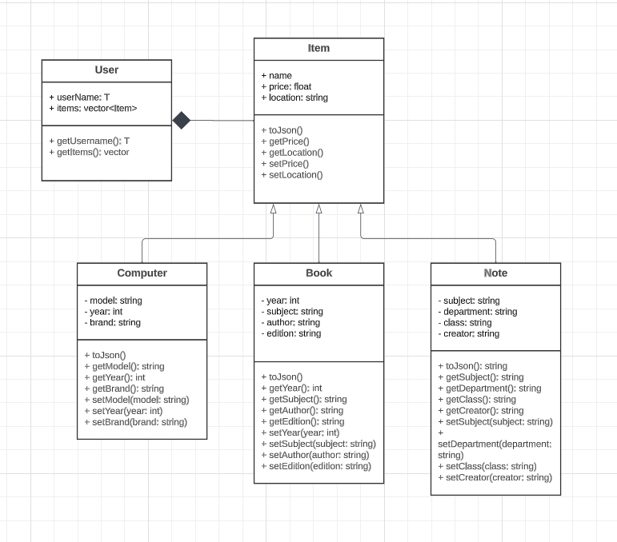

# Project Design Document

## Introduction
The intention of this website is to create a platform for students of University of Richmond to exchange the academic resources. This platform provides the opportunity to recycle and reuse. As a student, you can find, sell, and buy used materials from senior or graduated students. Three main things that we purpose is a computer, a text book of paper copy or electronic version, and class notes for a particular class. 

## Background/Context
The University of Richmond's student community is set to benefit from a novel web service designed to streamline the exchange of academic resources. This platform is conceived as a sustainable solution to the recurring need for affordable educational materials. Students are often required to invest in expensive textbooks, technology, and other study aids, which may only be of use for a single semester. Our web service aims to alleviate this financial burden by creating a marketplace where students can buy, sell, or trade these items with ease. The focus is on three main categories of resources: computers, textbooks (both in physical and electronic formats), and class notes. By facilitating a circular economy of academic materials, the platform not only supports students' educational pursuits but also promotes environmental sustainability and fosters a sense of community through resource sharing.

## Stakeholders
The current academic environment is dynamic and often costly, with students regularly facing the need to acquire various resources that are essential for their studies. Textbooks, class notes, and computers are typically among the most significant expenses for students. However, once a course is completed, these resources often lose their immediate value to the owner but retain their intrinsic educational worth. The web service being proposed aims to address this inefficiency by providing a platform where educational resources can be circulated within the University of Richmond's student body. The service seeks to mitigate the financial burden on students by fostering a community where resources can be passed down or exchanged, thus extending the useful life of educational materials and technology.

## Functional Requirements
Item Listing and Management:
The service will allow users to create, read, update, and delete listings for computers, books, and notes.
Each item can be converted into a JSON format for easy data interchange, possibly for use with a RESTful API or front-end interface.

Computer Resource Management:
Users can add details about computers, including model, year, and brand.
Users have the ability to get and set these attributes.

Book Resource Management:
Users can list books with attributes such as year, subject, author, and edition.
Users can retrieve and update information about each book.

Note Resource Management:
Users can list class notes with details about the subject, department, class, and creator.
Users have the functionality to retrieve and update these details.

## Use Case Description
As a Seller: “As a student, I want to list a used textbook for sale so that I can earn some money back after completing the course.”

As a Buyer: “As a student, I want to search for a used computer on the platform so that I can find a more affordable option for my studies.”

As an Exchange Participant: “As a graduating student, I want to list my class notes so that I can pass them on to other students who might benefit from them.”

## List Of Resources
User: Represents the individual using the service to exchange items.

Item: The base class for exchangeable objects, with common properties like name, price, and location.

Computer: A subclass of Item for listing computers, with specific attributes like model and brand.

Book: A subclass of Item for listing books, with attributes such as subject and edition.
Note: A subclass of Item for listing class notes, detailing the class and subject matter.

## List of End Points
#### /users:

POST: Create a new user profile.
GET: Retrieve user profiles.

#### /users/{userId}/items:

GET: Retrieve a list of items associated with a user.
POST: Add a new item to the user's list.

#### /items/computers:

GET: Retrieve all computer listings.
POST: Create a new computer listing.

#### /items/books:

GET: Retrieve all book listings.
POST: Create a new book listing.

#### /items/notes:

GET: Retrieve all note listings.
POST: Create a new note listing.

## UML Diagrams

